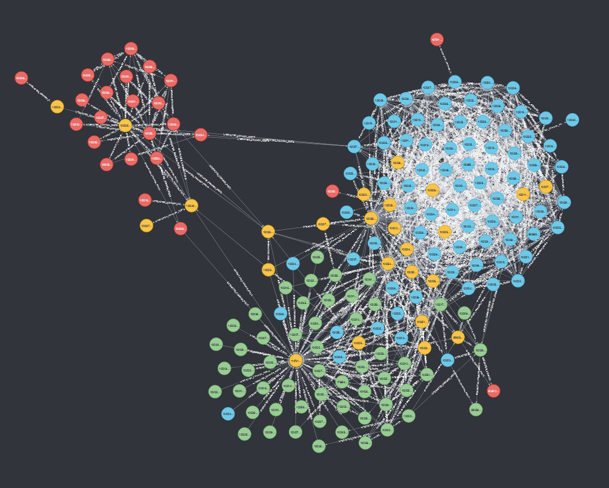

# Neo4j-social-network

1. Import social data
2. Create relationships between users
3. Project graph
4. Calculate User nodes PageRank, Betweenness Centrality and apply Louvain to detect communities
5. Visualize

